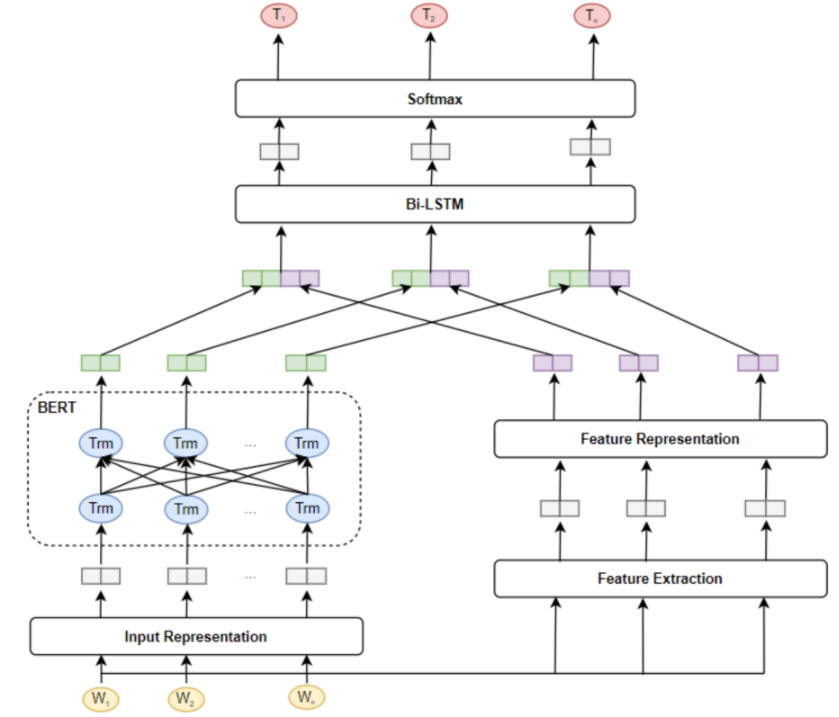

# Vietnamese Named-Entity Recognition

## Introductions
This is a Pytorch implementation of Named Entity Recognition (NER) for Vietnamese. Pretrained model from [BERT Hugging Face](https://huggingface.co/bert-base-multilingual-cased) and [Underthesea](https://github.com/undertheseanlp/underthesea) Toolkit for sentence segmenttation to pre-process input raw text is used.



## Installation
Requirements:
- Python 3.7
- Pytorch 1.7

Install dependencies:

`pip install -r requirements.txt`

You can review the `requirements.txt`'s **comment** for an appropriate Pytorch version.

## Dataset format
The [input data](https://drive.google.com/drive/folders/1BxOEYSd0TcEhAH3IXDHKlSmVUJGoS2Ly?usp=sharing) is from VietAI Advanced NLP-02 class.

Its format follows [CoNLL-2003](https://aclanthology.org/W03-0419.pdf) format with four columns separated by a tab character, including of **Word**, **POS tag**, **Chunking tag**, **Named-Entity tag**, and **nested Named-Entity**. However, I do not use the **nested named entity** column due to the requirements of VietAI Advanced NLP-02 class.

The data consists of 4 entities: 
- **PER**: person.
- **ORG**: organization.
- **LOC**: location.
- **MISC**: miscellaneous.

and

- **O**: others

**Note**: Structure of the dataset
```text
├── data
|  └── raw_data
|   └── test
|   └── train
```

Each word is put on a separate line and there is a start-of-sentence and end-of-sentence labels before and after each sentence, respectively. The table below describes an example Vietnamese sentence in dataset.

| Word      | POS | Chunk | NER   |
|-----------|-----|-------|-------|
|Dương	    |Np	  |B-NP	  |B-PER  |
|là	        |V	  |B-VP	  |O      |
|một	    |M	  |B-NP	  |O      |
|chủ       	|N	  |B-NP	  |O      |
|cửa    	|N	  |B-NP	  |O      |
|hàng	    |N	  |I-NP	  |O      |
|lâu	    |A	  |B-AP	  |O      |
|năm	    |N	  |B-NP	  |O      |
|ở	        |E	  |B-PP	  |O      |
|Hà  	    |Np	  |B-NP	  |B-LOC  |
|Nội	    |Np	  |I-NP	  |I-LOC  |
|.	        |CH	  |O	  |O      |

## Run the code
### Train
1. Create data in .csv format: `python create_data.py` (The train dataset is split into **Train-70%** and **Validation-30%**)

2. Train the model: `python train.py --data_dir new_data/ --model_name_or_path bert-base-multilingual-cased --output_dir outputs`

3. Convert the outputs of the model to the required format for submission: `python create_output.py`

### Predict
You can visualize the prediction: `python predict.py --pretrain_dir outputs/`

### Results
The overall performance of the model on validation dataset:

| Models              |       F1-Score                                                        ||||||
|---------------------|------------|------------|------------|------------|------------|-----------|
|                     | O          | MISC       | PER        | ORG        | LOC        | F1-Score IOB-tag   |
| BERT                |  99.79%    |  95.87%    |  96.66%    |  84.78%    |  93.89%    |  **92.43%**   |
| BERT + LSTM        |  %    |  %    |  %    |  %    |  %    |  %   |
| BERT + feats + LSTM |  %    |  %    |  %    |  %    |  %    |  %   |

## Credit
- [datntt1997](https://github.com/datnnt1997)